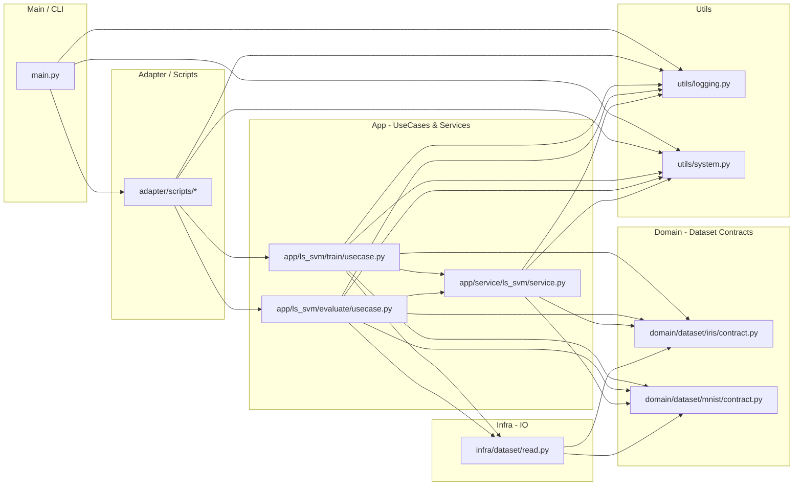

# fs4c
- fs4c(feature selection for classification)
- 分類のための特徴量選択手法を比較するためのリポジトリ


## Environment
- Python3.13
- uv

## Installation

```
uv sync
```

## development
- main.pyの実行
```
poe main
```

## Architecture
- レイヤードアーキテクチャを採用
- 以下の依存関係で開発を順守しながら開発を進める

